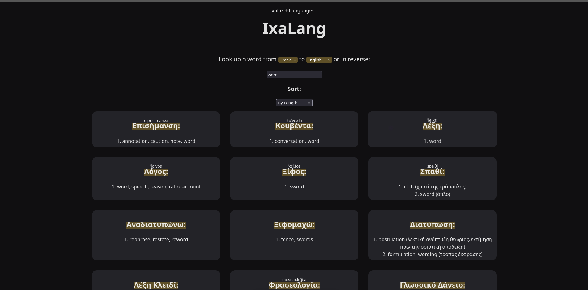
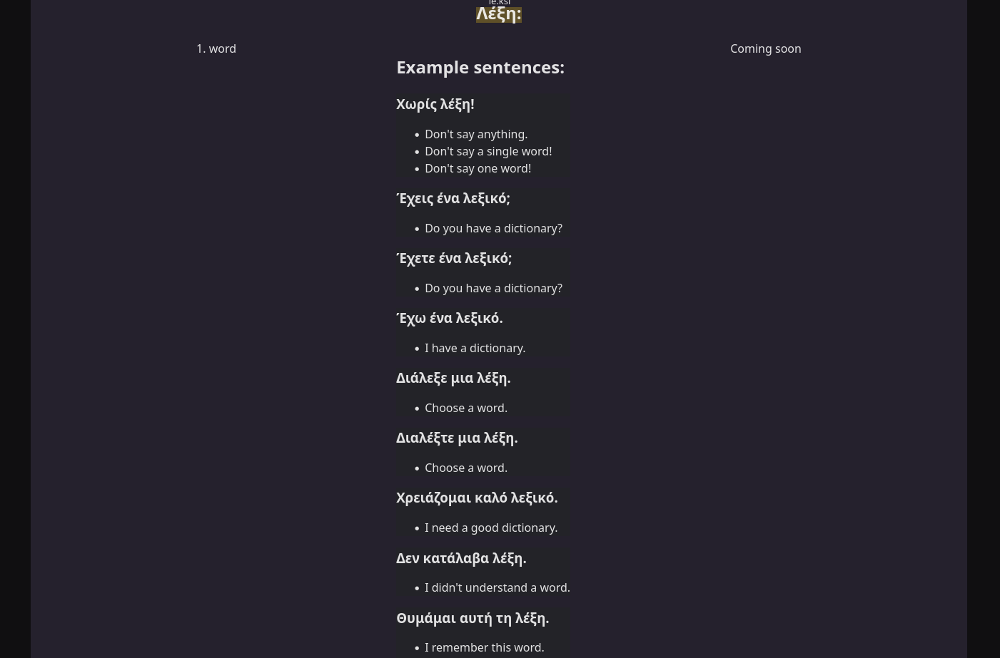

# About

This is a cool & simple dictionary (Ixalaz's Dictionary) made to search words in FreeDict.org XML files, since using their dictionary format is very restrictive (e.g there's no fuzzy or revers search).

## Screenshots

## Why it can't (currently) be used

For now, IxaLang can't really be used since you need to download the xml dictionary files from freedict.org yourself and then split them up into multiple (currently 5) smaller parts. For example, the greek to english dictionary file has to be split up in to assets/dictionaries/ell-eng/1.tei, 2.tei, 3.tei, 4.tei and 5.tei . The reason is that there is no other way I could find apart from opening multiple files in parallel to search the dictionaries fast (as the user's typing) in GO.

## The plan

As I wrote in the description of the "actually, remove wails app" commit:

> Silly of me - but the previous "major refactor" commit was in reality fully made 1.5 year ago. Back then I didn't know lower level programming languages or other GUI frameworks, so I thought GO Wails was the best option. However, it doesn't work on mobile, it isn't as mature as other ui frameworks, and it doesn't look and behave like a native (in linux a GTK or QT) app. For this reason, I think the future of IxaLang is a QT app using an XMLListModel.

> In fact, there is another 2 major issues with this app/site as it stands: The website won't work well in production (with many users) due the file bottleneck, and (most importantly!) the dictionaries are currently not included in GitHub, nor can be downloaded. Hence, the plan is to rewrite the app in C/C++ (using web assembly on the browser to download dictionary files).

For now (in the next few days), I will try to write a C header file to download dictionary files and search them with libxml2.

Then I will create a simple QT App in cmd/v2, and build it with flatpak. Finally, the website will work offline, using webassembly, by compiling the C header file to work for IndexDB.

## The future!

In the long term (in 2025) I hope to add japanese romanji and chinese pinyin support (ability to input japanese / chinese words using english / latin keyboard layout), add wiktionary.org data (and port the examples from Go to C / C++) and implement flashcard capability (using FreeSRS), potentially with a syncing capability to sync data between the mobile and desktop (QT) app.